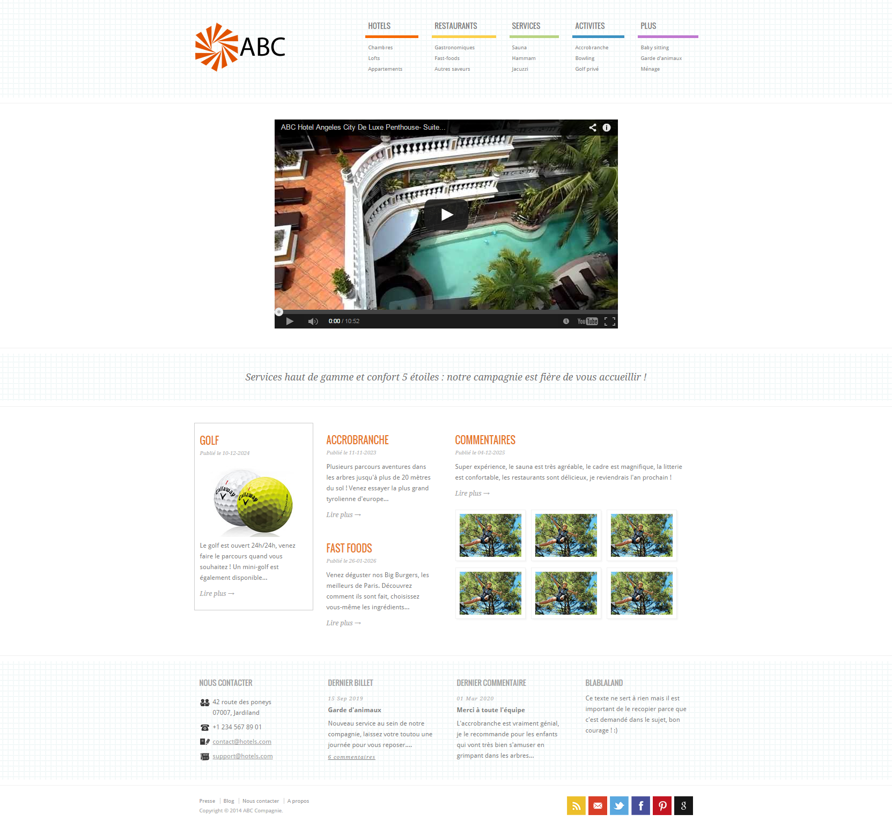
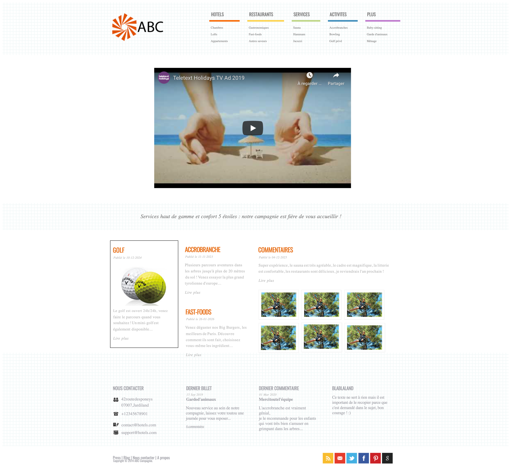

# MAQUETTE D'INTRODUCTION

[Le projet](http://maquette_introduction.sekhmset.me/)

## Projet

En vous appuyant sur le visuel de la maquette, vous devez intégrer une page en HTML5 et CSS3 conforme
au visuel, respectant les normes du W3C et optimisant au mieux le référencement.
Vous devez intégrer un player Youtube avec la vidéo de votre choix. Il se peut que l’affichage diffère légèrement de celui de l’exemple donné avec le sujet.
Par ailleurs, il faut que la maquette soit “accessible”. Lors de la soutenance, nous poserons des questions
liées à “l’accessibilité”.

### Résultat attendu

### Résultat final

